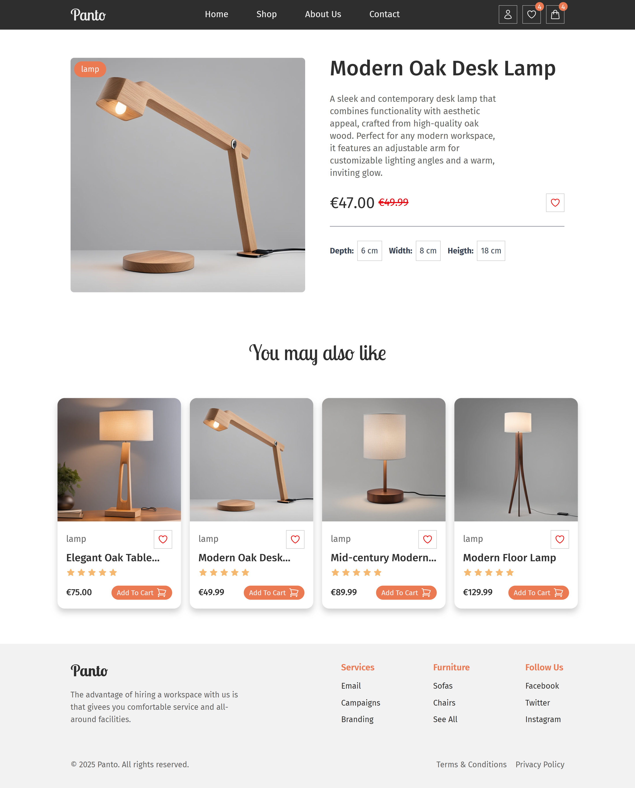
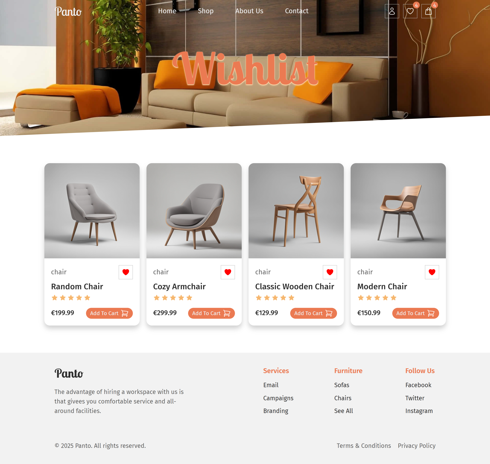

# 🏠🪴 Panto - Angular Furniture E-commerce

Panto is a modern, responsive furniture e-commerce frontend built with Angular 20, TypeScript, Tailwind CSS, NgRx, and PrimeNG. It allows users to browse, search, and filter a wide catalog of furniture, as well as save items to their Wishlist or Shopping Cart.

---

## 🛠️ Techs

---

## ✨ Features
- 🎨 **Modern UI inspired by a Figma design** | Built with Angular 20, Tailwind CSS, and PrimeNG for toast notifications. 
- 🌐 **Live API Integration** | Uses https://furniture-api.fly.dev/ for dynamic product data via HttpClient and RxJS. 
- 🛍️ **E-commerce Functionality** | Includes product filtering, keyword search, wishlist, and cart management. 
- 🧠 **State Management with NgRx** | Powered by NgRx Store and Effects, with localStorage persistence for Wishlist and Cart. 
- 📱 **Responsive Design** | Optimized for all devices — from mobile to desktop. 

---

## 📸 Screenshots

